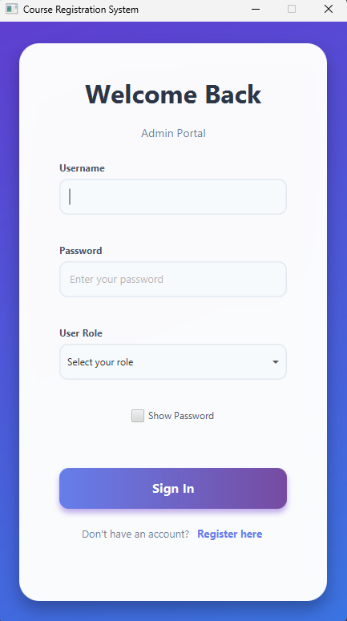
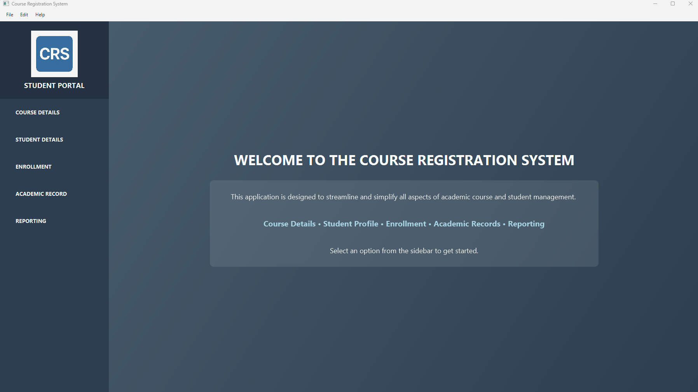
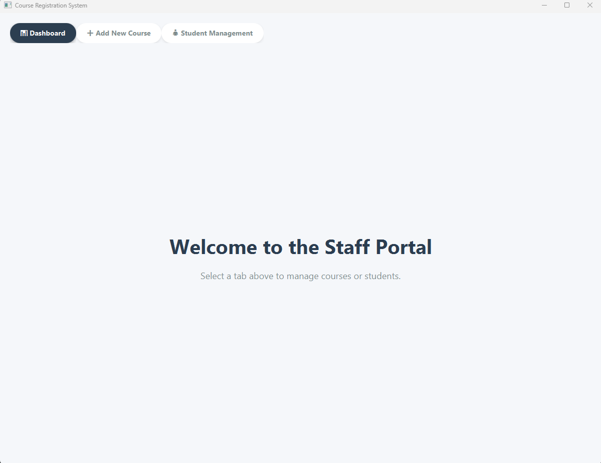
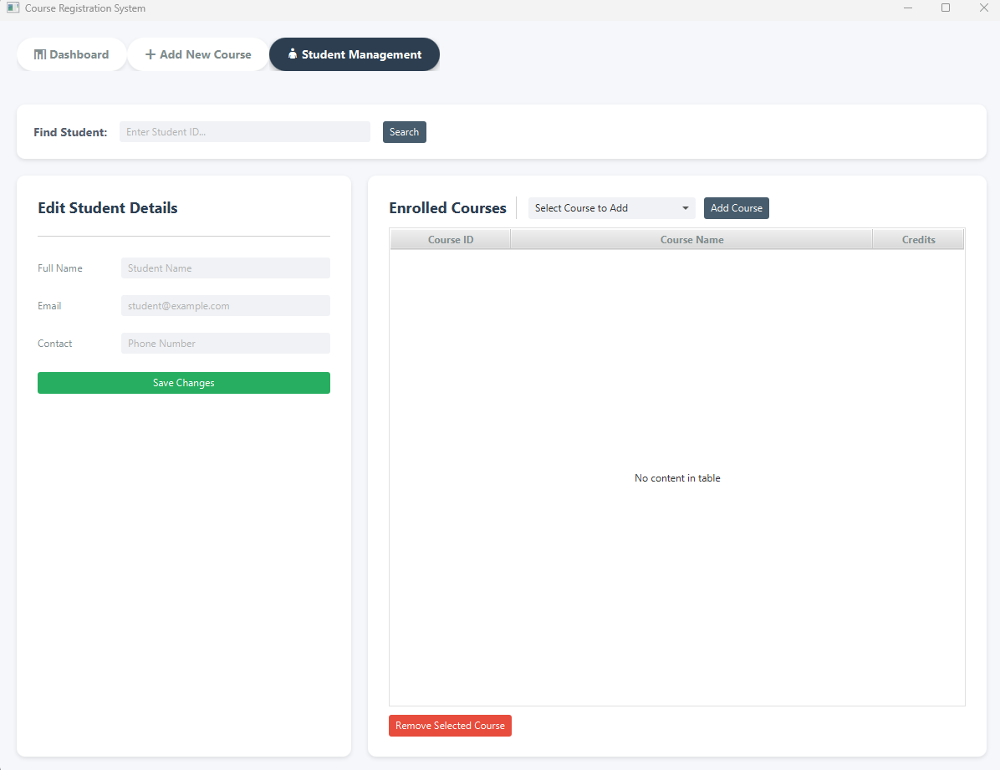

# Course Registration System (CRS)


## 📖 Overview

The **Course Registration System (CRS)** is a comprehensive desktop application designed to streamline academic management for educational institutions. Built with **JavaFX** and **MySQL**, it provides a modern, user-friendly interface for students to enroll in courses and for staff to manage curriculum and student records.

The system features role-based access control, ensuring secure and tailored functionality for **Students**, **Administrative Staff**, and **Admins**.

## ✨ Key Features

### 🎓 Student Portal
* **Course Details:** View a complete catalog of available courses including credits, hours, and capacity.
* **Enrollment Management:** Search for courses and self-enroll with a simple interface.
* **Student Profile:** View personal details, student ID, GPA, and a history of enrolled courses.
* **Academic Records:** Access grading history and academic progress (GPA tracking).

### 👨‍🏫 Staff / Faculty Portal
* **Dashboard:** A visual overview of system statistics (e.g., Total Students, Course data).
* **Course Management:** Create new courses by specifying Course ID, Name, Credits, Duration, and Participant Capacity.
* **Student Management:**
    * Search for students by ID.
    * Edit student contact and personal details.
    * Manually add or remove courses for specific students.

### 🔐 Security & Access
* **Role-Based Login:** Secure authentication for Students, Admins, and Staff.
* **Registration:** New users can create accounts with specific roles.

## 🛠️ Tech Stack

* **Language:** Java (JDK 21)
* **GUI Framework:** JavaFX 21
* **Build Tool:** Maven
* **Database:** MySQL (Connector 8.0.33)
* **UI Libraries:**
    * *ControlsFX* & *FormsFX* for advanced UI components.
    * *BootstrapFX* for modern styling.
    * *Ikonli* for icons.
    * *TilesFX* for dashboard widgets.

## 🗄️ Database Schema

The application automatically initializes the following MySQL tables upon startup:

* **`student_details`**: Stores student login credentials.
* **`course_details`**: Stores course metadata (ID, Name, Credits, Hours, Capacity).
* **`student_academicDetails`**: Junction table mapping Students to Courses.
* **`admin_details`**: Admin credentials.
* **`staff_details`**: Staff credentials.

## 🚀 Getting Started

### Prerequisites
* **Java Development Kit (JDK) 21** or higher.
* **MySQL Server** installed and running locally on port `3306`.
* **Maven** installed (or use the included `mvnw` wrapper).

### Installation & Setup

1.  **Clone the Repository**
    ```bash
    git clone [https://github.com/Yomal-al/CRS.git](https://github.com/Yomal-al/CRS.git)
    cd CRS
    ```

2.  **Configure Database**
    * Open `src/main/java/com/example/hms/controller/DBConnection.java`.
    * Update the `DriverManager.getConnection` line with your MySQL username and password:
        ```java
        // Replace "root" and "your_password" with your credentials
        connection = DriverManager.getConnection("jdbc:mysql://localhost:3306/", "root", "your_password");
        ```
    * *Note: The application will automatically create the `CRS` database and tables if they do not exist.*

3.  **Build the Project**
    Using the Maven Wrapper:
    ```bash
    ./mvnw clean install
    ```

4.  **Run the Application**
    ```bash
    ./mvnw javafx:run
    ```

## 🖥️ Usage Guide

1.  **Launch the App:** You will be greeted by the Login Portal.
2.  **Register:** If you don't have an account, click "Register here", select your role (Student/Staff), and create credentials.
3.  **Login:** Use your credentials to access your specific dashboard.
    * **Students:** Navigate using the sidebar to check courses or enroll.
    * **Staff:** Use the top tabs to switch between the Dashboard, Add Course form, and Student Management tools.

## 📸 Screenshots

|                          Login Portal                          | Student Dashboard |
|:--------------------------------------------------------------:|:-----------------:|
|  |              |

|                    Staff Dashboard                     | Course Management |
|:------------------------------------------------------:|:-----------------:|
|  |              |

## 🤝 Contributing

Contributions are welcome! Please fork the repository and create a pull request for any feature enhancements or bug fixes.

1.  Fork the Project
2.  Create your Feature Branch (`git checkout -b feature/AmazingFeature`)
3.  Commit your Changes (`git commit -m 'Add some AmazingFeature'`)
4.  Push to the Branch (`git push origin feature/AmazingFeature`)
5.  Open a Pull Request

## 📄 License

Distributed under the MIT License. See `LICENSE` for more information.